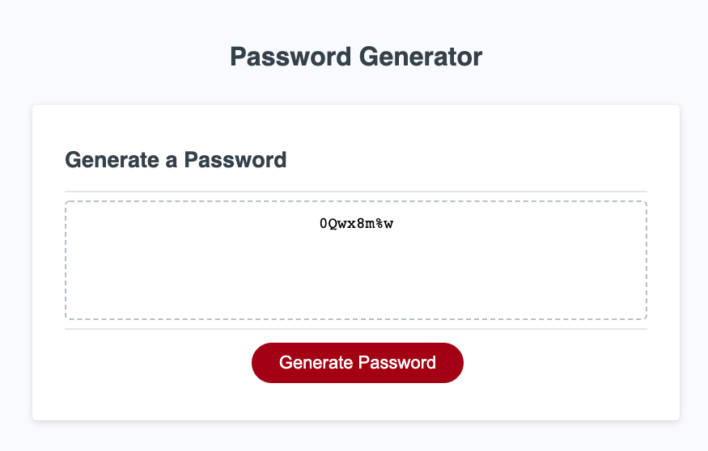
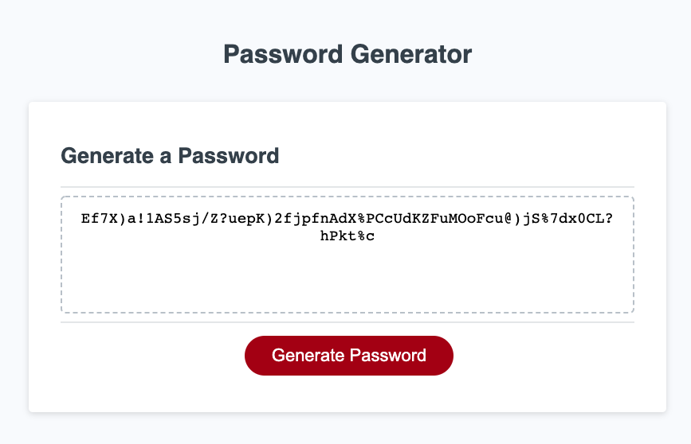
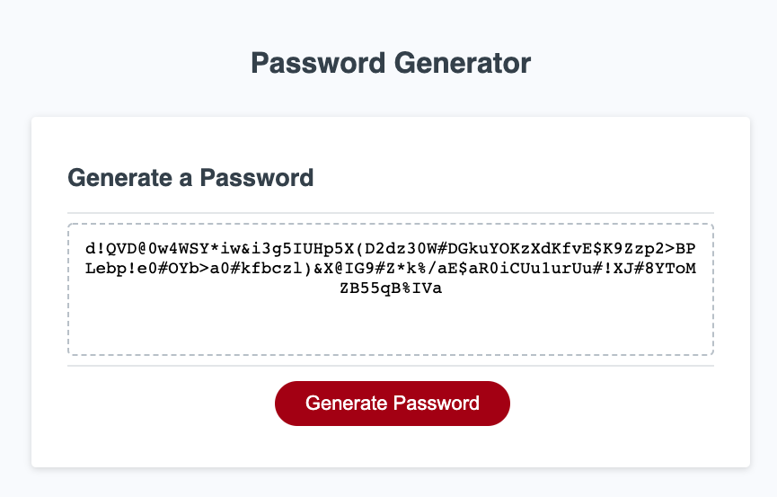

# Password Generator

## Table of Contents
* [Project Summary](##project-summary)
* [Technologies Used](##technologies-used)
* [Example Code](##example-code)
* [How to Access](##how-to-access)
* [About Me](##about-me)
* [Screenshots](##screenshots)
---

## Project Summary
This password generator accepts input from the user in terms of how long they want the password to be and what kind of characters they would like to include in the composition. It then creates a randomized password for the user.

## Technologies Used
* [JavaScript](https://developer.mozilla.org/en-US/docs/Web/JavaScript)
* [HTML5](https://developer.mozilla.org/en-US/docs/Web/Guide/HTML/HTML5)
* [CSS3](https://developer.mozilla.org/en-US/docs/Archive/CSS3)

## Example Code
Function prompts for password length ...
```
function getLength() {
  var inputLength = prompt("How many characters would you like your password to be? (Choose between 8 - 128.)");
  passwordLength = inputLength;
}
```
... and composition.
```
function getComposition() {
  lowerInput = confirm("Would you like to include lowercase letters?");
  if (lowerInput === true) {
    passwordComp = passwordComp.concat(alphaLower);
  }
```
Function to randomly select elements from a list and create a password string.
```
function getPassword() {
  for (var i = 1; i <= passwordLength; i++) {
    // Pick random element from list and add to password string.
    password += passwordComp[Math.floor(Math.random() * passwordComp.length)];
  }
}
```
Run validation checks on user's input.
```
if (passwordLength < 8 || passwordLength > 128) {
    alert("You must enter a number between 8 and 128");
    lengthCheck = false;
```
```
if (characterInput === false && numberInput === false && upperInput === false && lowerInput === false) {
    alert("You must choose at least one of the options.")
    compCheck = false;
```
```
if (lengthCheck === false || compCheck === false) {
    alert("Invalid password options chosen. Try again.")
```

## How to Access
[Password Generator](https://profjjk.github.io/password-generator/)

## About Me
* [LinkedIn](www.linkedin.com/in/the-real-jordan-kelly)
* [GitHub](https://github.com/profjjk)

## Screenshots


